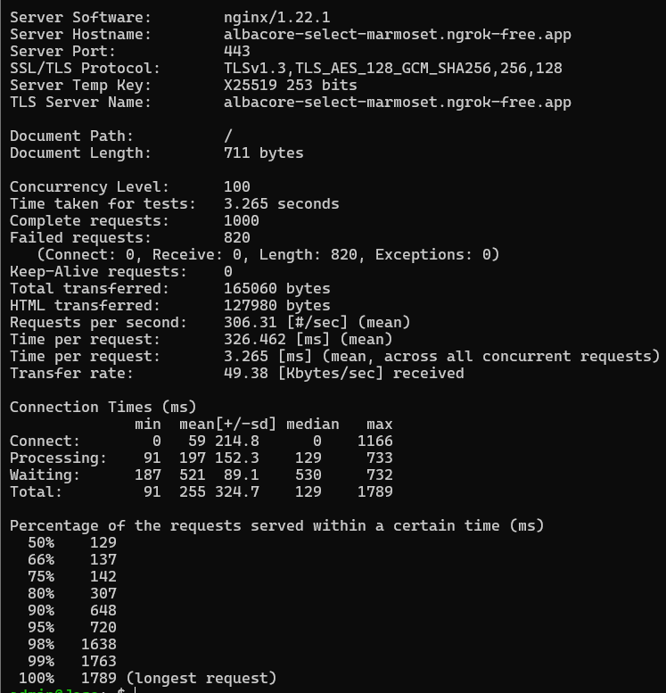
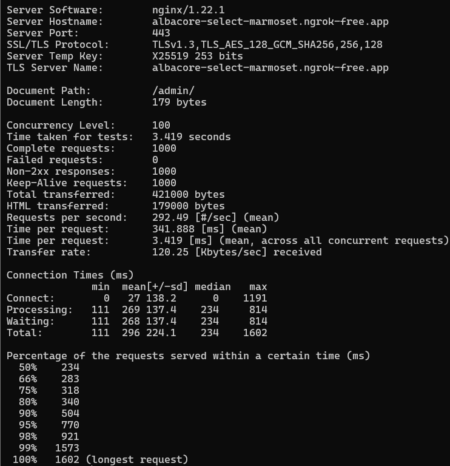
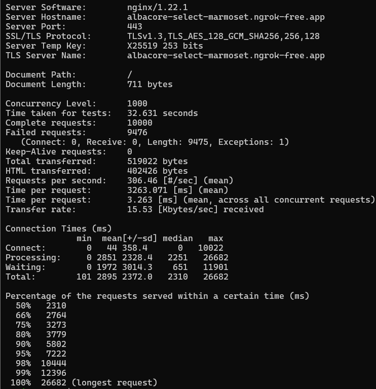
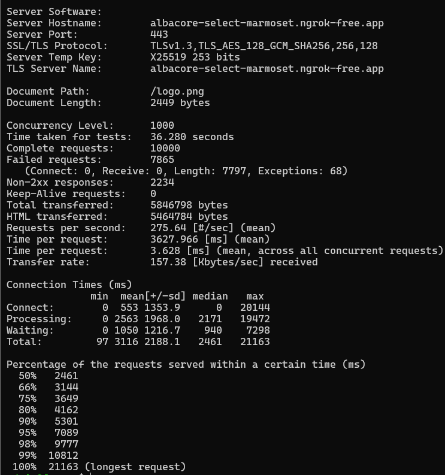
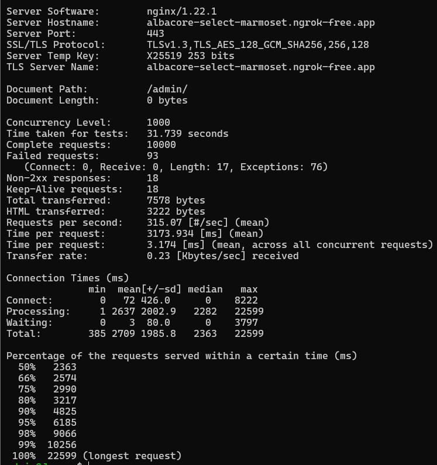
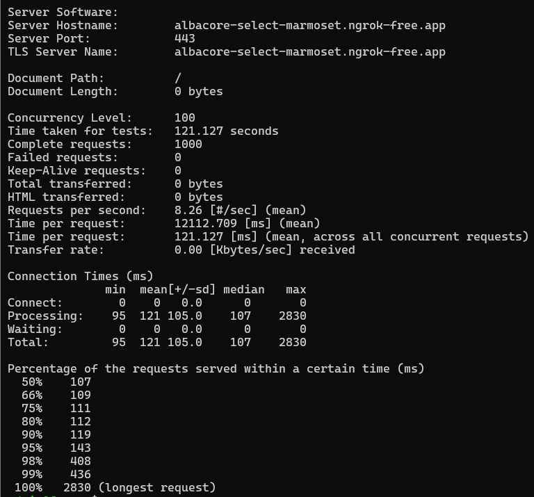
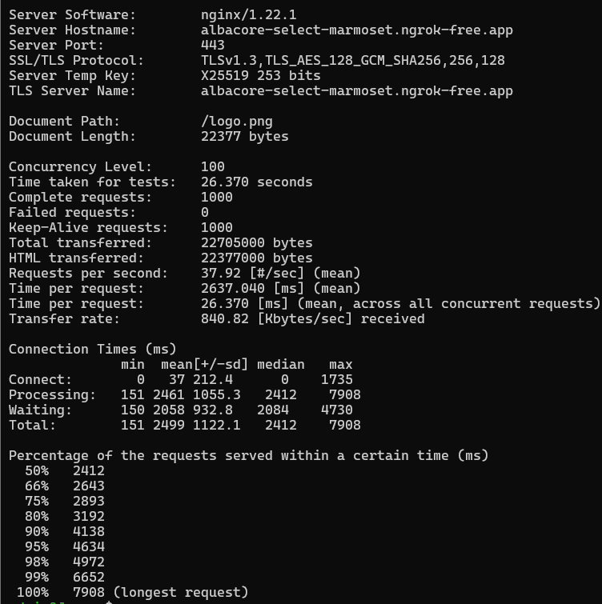
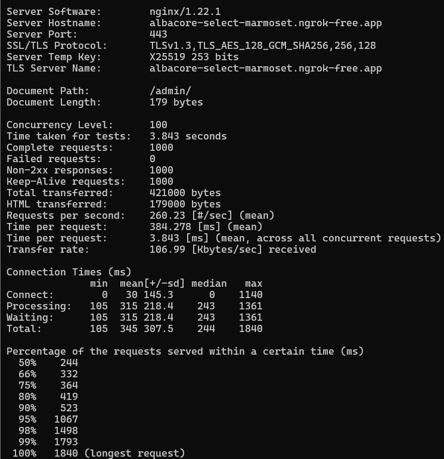

# Proyecto de self hosting

## Introducción

¡Bienvenido al proyecto de Servidor Web con Nginx y Ansible en Vagrant!
Este proyecto despliega un servidor web autogestionado utilizando tecnologías como Vagrant, Ansible, y Nginx. Incluye funcionalidades como:

- Autenticación básica para páginas protegidas.
- Generación de certificado proporcionado por Let's Encrypt.
- Túnel público con Ngrok para acceder desde cualquier lugar.
- Monitorización en tiempo real con Netdata.
- Pruebas de rendimiento.

Además, el servidor incluye páginas personalizadas, como una página principal, una de administración, y una página de error 404.

## Tabla de contenidos:

1. [Requisitos Previos](#1-requisitos-previos)
2. [Estructura del Proyecto](#2-estructura-del-proyecto)
3. [Tecnologías Utilizadas](#3-tecnologías-utilizadas)
4. [Certificado proporcionado por Let's Encrypt](#4-certificado-proporcionado-por-lets-encrypt)
    - [Instalar Certbot](#instalar-certbot)
    - [Configurar el certificado SSL](#configurar-el-certificado-ssl)
    - [Permitir HTTPS a través del firewall](#permitir-https-a-través-del-firewall)
    - [Obtener el certificado SSL](#obtener-el-certificado-ssl)
    - [Comprobación de Certificado](#comprobación-de-certificado)
5. [Autenticación básica](#5-autenticación-básica)
    - [Configuración en Ansible](#configuración-en-ansible)
    - [Archivo de Configuración Nginx](#archivo-de-configuración-nginx)
6. [Página de Error Personalizada](#6-página-de-error-personalizada)
7. [Status del servidor](#7-status-del-servidor)
    - [Instalación de Netdata en `/status`](#instalación-de-netdata-en-status)
    - [Configuración de Ngnix para Netdata](#configuración-de-nginx-para-netdata)
    - [Visualización de Netdata en `/status`](#visualización-de-netdata-en-status)
8. [Pruebas de rendimiento](#8-pruebas-de-rendimiento)
    - [Objetivos de las Pruebas](#objetivos-de-las-pruebas)
    - [Parámetros de las Pruebas](#parámetros-de-las-pruebas)
    - [Realización de las Pruebas](#realización-de-las-pruebas)
    - [Especificación de los Comandos](#especifiación-de-los-comandos)

## 1. Requisitos previos

Antes de comenzar, asegúrate de tener instalado y configurado lo siguiente en tu máquina:

### VirtualBox:

-Versión recomendada: 7.0 o superior.

### Vagrant:

-Herramienta para gestionar máquinas virtuales.

### Conexión a Internet:

-Necesaria para descargar dependencias y realizar configuraciones automáticas.

## 2. Estructura del Proyecto

```bash
vagrant-ansible-nginx/
├── Vagrantfile
├── ansible/
│   ├── playbook.yml                # Playbook principal para Ansible.
│   ├── roles/
│   │   ├── nginx/
│   │   │   ├── handlers/
│   │   │   │   └── main.yml  
│   │   │   ├── tasks/
│   │   │   │   └── main.yml        # Tareas de configuración de Nginx.
│   │   │   ├── templates/
│   │   │   │   └── mi_web.conf.j2  # Configuración personalizada de Nginx.
│   │   │   └── files/              # Archivos HTML, CSS y recursos.              
└── README.md
```

## 3. Tecnologías Utilizadas

Este proyecto combina varias herramientas modernas para la automatización y el despliegue eficiente de un servidor web. A continuación, se enumeran:

-Vagrant
    -Provisión de entornos virtuales portátiles.

-Ansible
    -Herramienta de automatización para la configuración y gestión de servidores.

-Nginx
    -Servidor web y proxy inverso de alto rendimiento.

-Ngrok
    -Permite exponer el servidor local a través de un túnel seguro accesible desde cualquier parte del mundo.

-Let's Encrypt
    -Generación de certificados SSL gratuitos para asegurar la conexión HTTPS.

-Netdata
    -Sistema de monitorización en tiempo real para recursos del servidor.

## 4. Certificado proporcionado por Let's Encrypt

### Instalar Certbot

``` bash
sudo apt install snapd
sudo snap install core
sudo snap refresh core
sudo snap install --classic certbot
sudo ln -s /snap/bin/certbot /usr/bin/certbot
```

### Configurar el certificado SSL

``` bash
sudo nano /etc/nginx/sites-available/mi_web
```

``` /etc/nginx/sites-available/mi_web
...
ServerName mi_web;
...
```

``` bash
sudo nginx -t
sudo systemctl reload nginx
```

### Permitir HTTPS a través del firewall

``` bash
sudo ufw allow 'WWW Full'
sudo ufw delete allow 'WWW'
```

### Obtener el certificado SSL

``` bash
sudo certbot --apache -d mi_web -d www.mi_web
```

### Comprobación de Certificado

En el navegador, debemos comprobar el emisor del certificado:


## 5. Autenticación Básica

La autenticación básica en este servidor está configurada a través de archivos .htpasswd y se utiliza para proteger áreas específicas de la web, como el panel de administración y el estado del servidor.

En este caso, se ha configurado para las siguientes rutas:

-/admin: Un área de administración protegida.
-/status: Una página de estado del servidor.

### Configuración en Ansible

``` main.yml
- name: Create .htpasswd files
  shell: |
    echo -n 'admin:' >> /etc/nginx/.htpasswd_admin
    echo "$(openssl passwd -apr1 'asir')" >> /etc/nginx/.htpasswd_admin
    echo -n 'sysadmin:' >> /etc/nginx/.htpasswd_status
    echo "$(openssl passwd -apr1 'risa')" >> /etc/nginx/.htpasswd_status
  args:
    creates: /etc/nginx/.htpasswd_admin
```

### Archivo de configuración Nginx

La autenticación básica en Nginx se configura en los archivos de configuración de los sitios. La directiva auth_basic se utiliza para activar la protección, y la directiva auth_basic_user_file señala el archivo .htpasswd correspondiente.

En el archivo de configuración de Nginx, /etc/nginx/sites-available/mi_web, se incluye lo siguiente para proteger las rutas /admin y /status:

``` 
  location /admin {
    auth_basic "Área restringida";
    auth_basic_user_file /etc/nginx/.htpasswd_admin;
    try_files /admin.html =404; 
  }

  location /status {
    proxy_pass http://localhost:19999;
    proxy_set_header Host $host;
    proxy_set_header X-Real-IP $remote_addr;
    proxy_set_header X-Forwarded-For $proxy_add_x_forwarded_for;
    proxy_set_header X-Forwarded-Proto $scheme;
    proxy_http_version 1.1;
    proxy_set_header Upgrade $http_upgrade;
    proxy_set_header Connection "upgrade";
    auth_basic "Área restringida";
    auth_basic_user_file /etc/nginx/.htpasswd_status;

    location /status/api {
        proxy_pass http://localhost:19999/api;
    }
  }
```

## 6. Página de Error Personalizada

Una página de error personalizada es una forma de ofrecer una experiencia de usuario más amigable y controlada cuando algo no sale como se esperaba. En este proyecto, hemos configurado una página de error personalizada para el código HTTP 404 (página no encontrada). De esta manera, si un usuario intenta acceder a una página que no existe en el servidor, en lugar de mostrar una página de error estándar del servidor, se le mostrará una página de error diseñada especialmente para ello.


## 7. Status del servidor

En un entorno de servidores web, es útil tener una página que permita visualizar el estado del servidor en tiempo real. Esto puede ser importante para monitorear el rendimiento, la carga del servidor, y otros indicadores clave de salud del sistema. En este proyecto, se ha implementado una página de status del servidor que muestra información relevante sobre el estado del servidor, como estadísticas de recursos y métricas del sistema.

### Instalación de Netdata en /status

``` main.yml
- name: Install Netdata
  shell: |
    curl -sSL https://my-netdata.io/kickstart.sh | bash -s -- --dont-wait
  args:
    creates: /usr/sbin/netdata
```

### Configuración de Nginx para Netdata

```
  location /status {
    proxy_pass http://localhost:19999;
    proxy_set_header Host $host;
    proxy_set_header X-Real-IP $remote_addr;
    proxy_set_header X-Forwarded-For $proxy_add_x_forwarded_for;
    proxy_set_header X-Forwarded-Proto $scheme;
    proxy_http_version 1.1;
    proxy_set_header Upgrade $http_upgrade;
    proxy_set_header Connection "upgrade";
    auth_basic "Área restringida";
    auth_basic_user_file /etc/nginx/.htpasswd_status;

    location /status/api {
        proxy_pass http://localhost:19999/api;
    }
  }
```

### Visualización de Netdata en /status


## 8. Pruebas de Rendimiento

Una de las herramientas más sencillas y eficaces para realizar pruebas de rendimiento en un servidor web es ApacheBench (ab). Esta herramienta permite simular múltiples usuarios concurrentes y medir el rendimiento de la respuesta del servidor bajo diferentes cargas.

En este caso, realizaremos las pruebas de rendimiento desde un ordenador distinto al servidor web, utilizando dos configuraciones de carga diferentes:

- 100 usuarios concurrentes con 1000 peticiones.
- 1000 usuarios concurrentes con 10000 peticiones.

### Objetivos de las Pruebas

Se realizarán las pruebas sobre los siguientes recursos:

- Página principal: `/`.
- Recurso estático: `/logo.png`.
- Página de administración: `/admin/` (acceso con autenticación básica).

### Parámetros de las Pruebas

Los parámetros que se utilizarán son los siguientes:

- k: Mantiene la conexión viva entre el cliente y el servidor, lo que permite reutilizar la misma conexión para múltiples solicitudes HTTP en lugar de abrir una nueva para cada una, mejorando la eficiencia.

- H "Accept-Encoding: gzip, deflate": Indica al servidor que se comprima la salida de datos. Esta cabecera permite que el servidor envíe los datos comprimidos, lo que puede reducir el tamaño de la respuesta y mejorar los tiempos de carga. Se estima que esta compresión puede reducir el tamaño de los datos de un 25% a un 75%.

### Realización de las Pruebas

#### Para 100 usuarios concurrentes y 1000 peticiones

1. Página principal:

``` bash
ab -n 1000 -c 100 -k https://albacore-select-marmoset.ngrok-free.app/
```

##### Resultados



2. Recurso estático (logo.png):

```bash
ab -n 1000 -c 100 -k https://albacore-select-marmoset.ngrok-free.app/logo.png
```

##### Resultados


3. Página de administración (/admin):

```bash
ab -n 1000 -c 100 -k -A sysadmin:risa https://albacore-select-marmoset.ngrok-free.app/admin/
```

##### Resultados



#### Conclusiones

Como puntos positivos, el servidor maneja las solicitudes con tiempos de respuesta razonables en la mayoría de los casos, los recursos estáticos son entregados sin errores y la autenticación básica funciona correctamente sin afectar al rendimiento general.

Como áreas de mejora, en la prueba inicial hay un alto número de fallos que nos sugiere problemas con la capacidad del servidor y tiempos elevados en la entrega de recursos estáticos.

#### Para 1000 usuarios concurrentes y 10000 peticiones

1. Página principal:

``` bash
ab -n 10000 -c 1000 -k https://albacore-select-marmoset.ngrok-free.app/
```

##### Resultados



2. Recurso estático (logo.png):

```bash
ab -n 10000 -c 1000 -k https://albacore-select-marmoset.ngrok-free.app/logo.png
```

##### Resultados



3. Página de administración (/admin):

```bash
ab -n 10000 -c 1000 -k -A sysadmin:risa https://albacore-select-marmoset.ngrok-free.app/admin/
```

##### Resultados



#### Conclusiones

Como puntos positivos, el servidor muestra cierta capacidad para manejar tráfico concurrente. Los resultados de `/admin` demuestran tener un impacto limitado en el rendimiento general.

Como áreas de mejora, tenemos un alto número de solicitudes fallidas en `/` y `/logo.png`, señal de que no puede manejar eficientemente picos de tráfico y los tiempos de respuesta son elevados. 

Aumentar los recursos, como RAM o CPU, o usar técnicas de compresión y almacenamiento en caché serían buenas prácticas para reducir los cuellos de botella y mejorar el rendimiento del servidor.

#### Para 1000 usuarios concurrentes y 10000 peticiones con cabecera

1. Página principal:

``` bash
ab -n 1000 -c 100 -k -H "Accept-Encoding: gzip, deflate" https://albacore-select-marmoset.ngrok-free.app/
```

##### Resultados



2. Recurso estático (logo.png):

```bash
ab -n 1000 -c 100 -k -H "Accept-Encoding: gzip, deflate" https://albacore-select-marmoset.ngrok-free.app/logo.png
```

##### Resultados



3. Página de administración (/admin):

```bash
ab -n 1000 -c 100 -k -H "Accept-Encoding: gzip, deflate" -A sysadmin:risa https://albacore-select-marmoset.ngrok-free.app/admin/
```

##### Resultados



#### Conclusiones

Como puntos positivos, ninguna de las pruebas presentó solicitudes fallidas y la compresión mejoró los tiempos de respuesta y la eficiencia en los recursos estáticos como `/logo.png`.

Como áreas de mejora, hay falta de contenido transferido en `/` y aunque hayan mejorado, los tiempos por solicitud siguen siendo muy altos.


### Especifiación de los Comandos
    
- n especifica el número total de peticiones que se realizarán (1000 o 10000).
- c establece el número de conexiones concurrentes (100 o 1000).
- k habilita la opción Keep-Alive, que mantiene abiertas las conexiones entre el cliente y el servidor.
- H "Accept-Encoding: gzip, deflate" agrega la cabecera que solicita la compresión de la respuesta del servidor.
